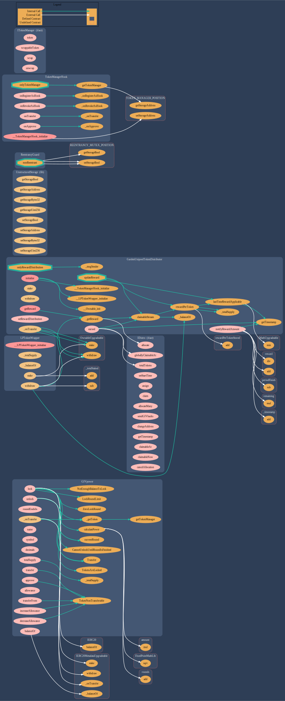

# 


# GivPower <a href="#"></a>

[](https://github.com/Giveth/givpower/actions/workflows/test.yml)
[](https://github.com/Giveth/givpower/actions/workflows/slither.yml)

## Background

TBD

### Upgrade script

1. Deploy a new instance of GIVpower by script
```
forge create --rpc-url <RPC_URL> --private-key <PRIVATE_KEY> contracts/GIVpower.sol:GIVpower 
```
> **_NOTE:_**  The verification part (--verify --etherscan-api-key <ETHERSCAN_API_KEY>) is optional  
2. Grab the address of new GIVpower instance deployed above and use it in calling `upgrade` method on `ProxyAdmin` contract by a privilaged account.
```
upgrade(<PROXY_CONTRACT_ADDRESS>, <NEW_GIVPOWER_IMPLEMENTATION_ADDRESS>)
```

## Deployments

<table>
<tr>
<th>Network</th>
<th>GardenUnipool (TransparentUpgradeableProxy)</th>
<th>ProxyAdmin</th>
</tr>

<tr><td>Gnosis Chain</td><td rowspan="14">

[0xD93d3bDBa18ebcB3317a57119ea44ed2Cf41C2F2](https://blockscout.com/xdai/mainnet/address/0xD93d3bDBa18ebcB3317a57119ea44ed2Cf41C2F2)

</td><td rowspan="14">

[0x076C250700D210e6cf8A27D1EB1Fd754FB487986](https://blockscout.com/xdai/mainnet/address/0x076C250700D210e6cf8A27D1EB1Fd754FB487986)

</td></tr>
</table>

## Diagram



## Foundry

This project use [Foundry](https://github.com/foundry-rs/foundry). To install (assuming a Linux or macOS system):

```
curl -L https://foundry.paradigm.xyz | bash
```

This will download foundryup. To start Foundry, run:

```
foundryup
```

To install dependencies:

```
forge install
```

To run tests:

```
forge test
```
